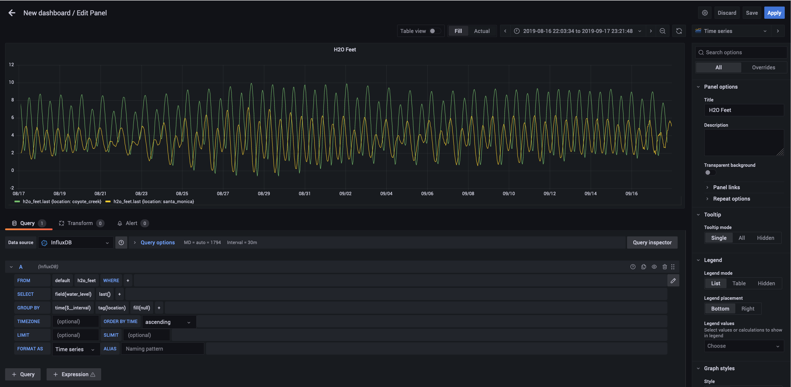

# Exemples pour InfluxDB

InfluxDB est un système de gestion de bases de données temporelles.

## Lancement du serveur InfluxDB avec Docker

```bash
mkdir -p data/influxdb
mkdir -p data/share
docker rm -f influx
docker network create influx
docker run -d --name influx --network influx -p 8086:8086 \
      -v $PWD/data/influxdb:/var/lib/influxdb \
      -v $PWD/data/share:/usr/share:ro \
      influxdb:1.8
docker ps
```

## Création de la base de données

```bash
docker exec -it influx influx -precision rfc3339
```

Entrez les commande suivantes dans la CLI d'InfluxDB
```
help
show databases
CREATE DATABASE NOAA_water_database
show databases
use NOAA_water_database
show measurements
show series
exit
```

## Peuplement de la base de données

> The sample data is publicly available data from the National Oceanic and Atmospheric Administration’s (NOAA) Center for Operational Oceanographic Products and Services. The data include 15,258 observations of water levels (ft) collected every six minutes at two stations (Santa Monica, CA (ID 9410840) and Coyote Creek, CA (ID 9414575)) over the period from August 18, 2015 through September 18, 2015.

```bash
cd data/share
curl https://s3.amazonaws.com/noaa.water-database/NOAA_data.txt -o NOAA_data.txt
wc -l NOAA_data.txt
head -20 NOAA_data.txt
docker exec -it influx influx -import -path=/usr/share/NOAA_data.txt -precision=s -database=NOAA_water_database
```

## Interroger la base de données

Connectez-vous à la base de données via la CLI 
```bash
docker exec -it influx influx -precision rfc3339 -database NOAA_water_database
```

```console
show measurements
show series
```

Essayez les commandes suivantes (qui sont décrites dans https://docs.influxdata.com/influxdb/v1.8/query_language/explore-data/)

```console
SELECT COUNT(*) FROM average_temperature
SELECT COUNT(*) FROM h2o_pH
SELECT COUNT(*) FROM h2o_feet
SELECT COUNT(*) FROM h2o_quality
SELECT COUNT(*) FROM h2o_temperature
SELECT * FROM "h2o_feet" ORDER BY time ASC LIMIT 1
SELECT * FROM "h2o_feet" ORDER BY time DESC LIMIT 1

SELECT COUNT("water_level") FROM h2o_feet
SELECT * FROM h2o_feet LIMIT 10
SELECT "level description","location","water_level" FROM "h2o_feet" LIMIT 10
SELECT "level description"::field,"location"::tag,"water_level"::field FROM "h2o_feet" LIMIT 10
SELECT *::field FROM "h2o_feet" LIMIT 10
SELECT ("water_level" * 2) + 4 FROM "h2o_feet" LIMIT 10
SELECT * FROM "h2o_feet","h2o_pH" LIMIT 10
SELECT * FROM "NOAA_water_database".."h2o_feet" LIMIT 10
SELECT * FROM "h2o_feet" WHERE "water_level" > 8 LIMIT 10
SELECT * FROM "h2o_feet" WHERE "level description" = 'below 3 feet' LIMIT 10
SELECT * FROM "h2o_feet" WHERE "water_level" + 2 > 11.9
SELECT "water_level" FROM "h2o_feet" WHERE "location" = 'santa_monica' LIMIT 10
SELECT "water_level" FROM "h2o_feet" WHERE "location" <> 'santa_monica' AND (water_level < -0.59 OR water_level > 9.95) LIMIT 10
SELECT * FROM "h2o_feet" WHERE time > now() - 7d
SELECT MEAN("water_level") FROM "h2o_feet" GROUP BY "location"
SELECT MEAN("index") FROM "h2o_quality" GROUP BY "location","randtag"
SELECT MEAN("index") FROM "h2o_quality" GROUP BY *
SELECT "water_level","location" FROM "h2o_feet" WHERE time >= '2019-08-18T00:00:00Z' AND time <= '2019-08-21T00:00:00Z'
SELECT COUNT("water_level") FROM "h2o_feet" WHERE "location"='coyote_creek' AND time >= '2019-08-18T00:00:00Z' AND time <= '2019-08-21T00:00:00Z' GROUP BY time(60m)
SELECT COUNT("water_level") FROM "h2o_feet" WHERE time >= '2019-08-18T00:00:00Z' AND time <= '2019-08-21T00:00:00Z' GROUP BY time(60m), location
SELECT MEAN("water_level") FROM "h2o_feet" WHERE time >= '2019-08-18T00:00:00Z' AND time <= '2019-08-21T00:00:00Z' GROUP BY time(60m), location

SELECT MAX("water_level") FROM "h2o_feet" WHERE "location"='coyote_creek' AND time >= '2019-08-18T00:00:00Z' AND time <= '2019-08-21T00:00:00Z' GROUP BY time(60m)

SELECT MAX("water_level") FROM "h2o_feet" WHERE "location"='coyote_creek' AND time >= '2019-08-18T00:00:00Z' AND time <= '2019-08-21T00:00:00Z' GROUP BY time(1m)
SELECT MAX("water_level") FROM "h2o_feet" WHERE "location"='coyote_creek' AND time >= '2019-08-18T00:00:00Z' AND time <= '2019-08-21T00:00:00Z' GROUP BY time(1m) fill(100)
SELECT MAX("water_level") FROM "h2o_feet" WHERE "location"='coyote_creek' AND time >= '2019-08-18T00:00:00Z' AND time <= '2019-08-21T00:00:00Z' GROUP BY time(1m) fill(previous)
exit
```


## Interrogation avec Grafana

```bash
mkdir -p data/influxdb
docker run -d --name=grafana --network=influx \
      -p 3000:3000 \
      -e "GF_INSTALL_PLUGINS=grafana-clock-panel,grafana-simple-json-datasource" \
      grafana/grafana
```

Ouvrez la console de Grafana http://localhost:3000

L'utilisateur et le mot de passe par défaut sont `admin` `admin`

Changez le mot de passe.

Ajoutez une datasource de type InfluxDB
* Le champ `URL` est : `http://influx:8086`
* Le champ `Database` est : `NOAA_water_database`
* Le champ `User` est vide
* Le champ `Password` est vide

Validez avec le bouton `Save & test`.

Ajoutez un nouveau _Dashboard_.

Ajoutez un nouveau _Panel_ en configurant la requête sur la base de données `NOAA_water_database` de la manière suivante:



> Le _time range_ (en hout à droite_) doit entre 2021-08-16 et 2021-08-18.

Inspectez la requête construite avec _Query Inspector_. La requête Influx ressemble à :

```sql
SELECT last("water_level") FROM "h2o_feet" WHERE time >= 1565985814588ms and time <= 1568755308047ms GROUP BY time(30m), "location" fill(null)
```

Vous pouvez directement importer le _dashboard_ dans Grafana via le sommaire `+ > Import` et en selectionnant le fichier JSON `dashboard.json`.

## Ajout de mesure en live avec Telegraf 

Telegraf mesure les performances d'une machine ou de services tournant sur celle-ci (ie haproxy, apache httpd, nginx, postgres ...). Les mesures sont stockées dans des bases de données temporelles (par défaut InfluxDB). Il dispose de [nombreux plugins](https://docs.influxdata.com/telegraf/v1.20/plugins/) pour la collection de mesure et leurs stockages.

Lancez Telegraf au sein du conteneur Influx.

```bash
docker run -d --net=container:influx telegraf
```

Connectez-vous à la base de données via la CLI 
```bash
docker exec -it influx influx -precision rfc3339 -database NOAA_water_database
```

```console
show databases
use telegraf
show measurements
show series
select count(*) from cpu;
select count(*) from disk;
select count(*) from process;
select count(*) from mem;
```

Exercice: Utilisez ces séries temporelles pour surveiller votre machine en ajouter une nouvelle source de données `telegraf`et un nouveau tableau de bord à Grafana.

La solution est [ici](https://grafana.com/grafana/dashboards/1443).


## Arrêt du serveur de base de données
```bash
docker stop influx grafana
docker rm -f influx grafana
docker network rm influx
```
