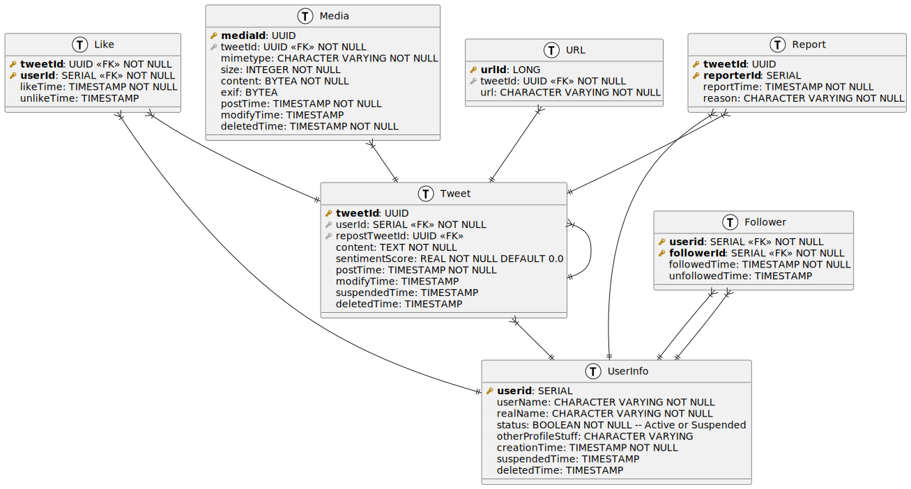

#  Sujet de DM1 2024-2025

Polytech Grenoble :: INFO 4A :: UE Bases de Données

Rédacteur(s): Didier DONSEZ + promo INFO4

> La date et heure limite du rendu du DM est sur Moodle.

## Partie 1: Interrogation 

Le sujet de cette partie est inspiré de l'article System Design Interview: Design Twitter (X) de Hayk Simonyan sur Medium https://medium.com/javarevisited/how-to-design-twitter-in-a-system-design-interview-98983c649cc0

Les plateformes de réseaux sociaux (comme twitter/X, facebook, instagram, tiktok, linkedin, strava, zwift ...) sont toutes concues selon le scénario suivant. Les utilisateurs (User) authentifiés doivent pouvoir composer et partager des tweets, ce qui constitue la fonction principale de la plateforme. Cela implique la création d’un nouveau tweet, l’ajout facultatif de médias (media) et son partage avec leurs abonnés (follower). Le contenu (content) d'un tweet qui est maintenant limité à 280 signes (10000 signes pour l'offre payante) peut comporter des hashtags (mot préfixé d'un `#`), des références à d'autres utilisateurs (username précédé d'un `@`) et des URL qui sont minifiées et suivies. De plus, les utilisateurs doivent pouvoir republier (repost) un tweet. De plus, les utilisateurs doivent pouvoir suivre d’autres utilisateurs afin de voir leurs mises à jour dans leur flux. Cela implique la création d’un nouveau tweet, l’ajout facultatif de médias et son partage avec leurs abonnés. De plus, les utilisateurs doivent pouvoir suivre d’autres utilisateurs afin de voir leurs mises à jour dans leur flux. Cela signifie gérer une liste d’utilisateurs suivis et s’assurer que leurs tweets apparaissent dans la timeline de l’utilisateur. Une autre fonctionnalité essentielle est de permettre aux utilisateurs de “liker” des tweets, indiquant leur appréciation et potentiellement de les enregistrer pour une consultation future. Un utilisateur peut signaler un comportement inapproprié dans un tweet en complétant un rapport à propos de son contenu afin que la plateforme puisse modérer son rédaction voir susprendre son compte (https://help.x.com/fr/safety-and-security/report-abusive-behavior).

Voici les principales exigences fonctionnelles pour référence :
* Composer et Partager des Tweets : Les utilisateurs doivent pouvoir créer et partager des tweets.
* Suivre des Utilisateurs : Les utilisateurs doivent pouvoir suivre d’autres utilisateurs et voir leurs mises à jour.
* Aimer des Tweets : Les utilisateurs doivent pouvoir liker des tweets pour montrer leur appréciation.

Un [possible schéma de la base de données](twitter.plantuml) est constituée de 5 tables : User, Follower, Tweet, Media, Like, Report, URL

Requêtes: Répondez à 10 questions parmi les questions suivantes au moyen de requêtes SQL (Postgres).
* [ ] Q1: Donnez la liste des tweets de [@CampusIoT](https://twitter.com/CampusIoT)
* [ ] Q2: Donnez la liste des tweets qui [contiennent à la fois le hashtag #postgresql et le hashtag #mysql](https://twitter.com/search?q=%23postgresql%20%23mysql&src=typed_query&f=top)
* [ ] Q3: Donnez la liste des tweets référencant l'utilisateur @Frigiel
* [ ] Q4: Donnez la liste des tweets de @Frigiel antérieurs à 2020 supprimés (retirés) ou modifiés.
* [ ] Q5: Donnez le fil d'accueil de [@CampusIoT](https://twitter.com/CampusIoT) : ie les tweets des utilisateurs suivis par @CampusIoT ainsi que les tweets des autres utilisateurs contenant [@CampusIoT](https://twitter.com/CampusIoT). Remarque: Pensez à exclure les tweets des utilisateurs suspendus.
* [ ] Q6: Donnez le nombre de tweets postés dans la dernière heure
* [ ] Q7: Donnez les tweets les plus republiés dans la dernière heure
* [ ] Q8: Donnez les utilisateurs qui suivent à la fois les utilisateurs @realDonaldTrump et @KamalaHarris
* [ ] Q9: Donnez la liste des 'lurkers' : ie les utilisateurs qui ne redigent ni republient des tweets, qui ne suivent personne, et qui n'aiment aucun tweet.
* [ ] Q10: Donnez le nombre moyen de tweets contenant des hashtags par utilisateur
* [ ] Q11: Donnez le nombre moyen de 'likes' des tweets de l'utilisateur [@rdicosmo](https://twitter.com/rdicosmo)
* [ ] Q12: Donnez les utilisateurs qui ont plus de followers que de 'following' 
* [ ] Q13: Donnez les tweets les plus likés dans les dernières 6 heures (en incluant le score de sentiment moyen).
* [ ] Q14: Donnez les tweets qui ont l'objet d'un grand nombre des rapports de comportement inappropriés.
* [ ] Q15: Donnez les tweets qui sont des republications de tweets qui ont l'objet d'un grand nombre des rapports de comportement inappropriés.
* [ ] Q16: Donnez les utilisateurs qui ont aimé le plus de tweets supprimés.
* [ ] Q17: Donnez les utilisateurs qui ont aimé le plus de tweets d'utilisateurs suspendus.
* [ ] Q18: Donnez le nombre de utilisateurs connectés en même temps qu'au moins 1 de leurs followers.
* [ ] Q19: Donnez les utilisateurs dont le nombre de tweets contenant des images est supérieur à 70%.
* [ ] Q20: Donnez les 10 utilisateurs qui ont fait la blague la plus drôle 😀 (Astuce : le contenu contient un ou plusieurs [Emoji U+1F60x](https://fr.wikipedia.org/wiki/%C3%89moji)).
* [ ] Q21: Donnez la liste des utilisateurs qui semblent être des trolls ou des bots : ie beaucoup d'abonnés en très peu de temps, des abonnés qui sont eux-même des trolls ou des bots, ...
* [ ] Q22: Donnez la liste des hashtags les plus populaires (aka tendances) ces dernières 24 heures. 
* [ ] Q23: Donnez les tweets qui semblent être générés par un [transformeur GPT](https://fr.wikipedia.org/wiki/Transformeur) (IA générative).
* [ ] Q24: Donnez les medias qui semblent être générés par un [transformeur GPT](https://fr.wikipedia.org/wiki/Transformeur) (IA générative).

Parmi les 10 questions, vous choissirez des questions qui nécessitent
* soit une jointure externe à droite
* soit une agregation
* soit des valeurs absentes
* soit une operation ensembliste (union, intersection, difference)

### Rendu

Vous devez rendre deux fichiers SQL [`populate.sql`](populate.sql) et [`queries.sql`](queries.sql) qui contiennent :
* 1. en en-tête commenté : les noms prénoms composant le binôme
* 2. la partie création de tables (DROP TABLE, CREATE TABLE, INSERT) ; vous devez ajouter les tuples (ie peupler la base) nécessaire pour afficher les réponses aux requêtes ci-dessus (et compter le nombre de lignes)
* 3. pour chaque requête, le SQL correspondant et, en commentaire : l’explication de la requête et la sortie de cette requête sur votre base exemple.

> Astuce pour les requêtes de type `TOP10`, `TOP100`, "le plus ...", "hall of fame", "King of the Mountain (KOM)" ... : https://www.postgresql.org/docs/current/queries-limit.html

Pour peupler la base, vous pourrez utiliser des datasets publics de tweets 
* https://www.kaggle.com/datasets/jp797498e/twitter-entity-sentiment-analysis
* https://www.kaggle.com/datasets/hbaflast/french-twitter-sentiment-analysis
* https://www.kaggle.com/code/erikbruin/text-mining-the-clinton-and-trump-election-tweets
* ...

> Astuce: Utilisez des tables temporaires pour charger les fichiers CSV et peuplés les 5 tables.

> Important : ce fichier SQL doit être executable est testable dans le container Docker PostgreSQL utilisé en TP.
 
Vous devez rendre ce fichier via Moodle, à l’exclusion de tout autre moyen, par un seul membre du binôme.

## Partie 2: Estimation de la base d’utilisateurs de Twitter/X

L’estimation de la base d’utilisateurs de Twitter/X est de 500 millions d'utilisateurs. On suppose que chaque utilisateur tweete une fois par jour (500 millions de tweets par jour). Chaque tweet contient 0,5 images/video de 1000000 octets en moyenne. De plus, si chaque utilisateur consulte 10 pages de son fil d’actualité par jour. Les relations de suivi ajoutent également à la complexité, avec chaque utilisateur suivant en moyenne 100 autres utilisateurs, ce qui conduit à 50 milliards de relations de suivi. Chaque utilisateur aime 5 tweets par jour, cela représente 2,5 milliards de “likes” par jour.

Voici les principales exigences de trafic à prendre en compte ou à mentionner :
* Tweets : 500 millions de tweets par jour (un tweet par utilisateur par jour).
* Media : 250 millions de media par jour (0.5 media par tweet).
* Fil d’Accueil : Chaque utilisateur consulte 10 pages par jour.
* Suivis : Chaque utilisateur suit en moyenne 100 autres utilisateurs, conduisant à 50 milliards de relations de suivi.
* “Likes” : Chaque utilisateur aime 5 tweets par jour, conduisant à 2,5 milliards de “likes” par jour.

Question: A partir de la taille de chaque ligne des 5 tables définies ci-dessus, donnez l'augmentation journalier des tables Tweet, Media et Like. On suppose que les tables UserInfo et Follower évoluent lentement. Vous ne considerez pas les tables Report et URL. Donnez ensuite la taille des 5 tables pour 365 jours (un an) et sur 3650 jours (10 ans).
Voir https://github.com/donsez/bd/blob/main/postgres/work/extra/database_size.sql

## Partie 3 : Transactions
Suivez les instructions de tutoriel https://github.com/donsez/bd/tree/main/postgres/work/bank
Donnez le code de deux transaction debit-credit dont l'exécution entraine une situation d'interblocage.
Donnez la trace de la console des 2 transactions (et surtout le message d'erreur).

##  Partie 4 : Banc d'essai TPC-B
Suivez les instructions de tutoriel https://github.com/donsez/bd/tree/main/postgres/work/pgbench
Produisez au moins quatre rapports du banc d'essai pgbench et ajoutez ces rapports au fichier results.csv

