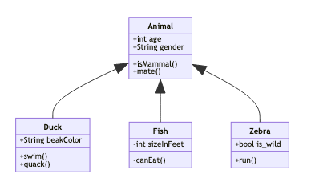

# Exemples des diagrammes UML avec Mermaid

[Mermaid](https://mermaid-js.github.io) est un utilitaire qui permet de créer des diagrammes et des visualisations à l'aide de texte et de code. Il est très indiqué pour documenter un projet logiciel et maintenir sa documentation via un dépôt Git.

## Installation
```bash
nvm use stable
brew install mermaid-cli
mmdc --help
```

## Visualisation d'un diagramme de classe en PNG
```bash
mmdc -i class_diagram.mmdc -o class_diagram.png
open class_diagram.png
```

`class_diagram.mmdc`:
```
 classDiagram
      Animal <|-- Duck
      Animal <|-- Fish
      Animal <|-- Zebra
      Animal : +int age
      Animal : +String gender
      Animal: +isMammal()
      Animal: +mate()
      class Duck{
          +String beakColor
          +swim()
          +quack()
      }
      class Fish{
          -int sizeInFeet
          -canEat()
      }
      class Zebra{
          +bool is_wild
          +run()
      }
```

Le résultat est 



## Visualisation d'un diagramme de classe en SVG
```bash
mmdc -i class_diagram.mmdc -o class_diagram.svg
open class_diagram.svg
```

> Le format SVG se visualise avec un navigateur web comme Firefox

## Réferences
* https://mermaid-js.github.io/mermaid/#/classDiagram
* https://github.com/mermaid-js/mermaid-cli
* https://gitlab.tetras-libre.fr/tetras-libre/docker-images/docker-compose-viz-mermaid


