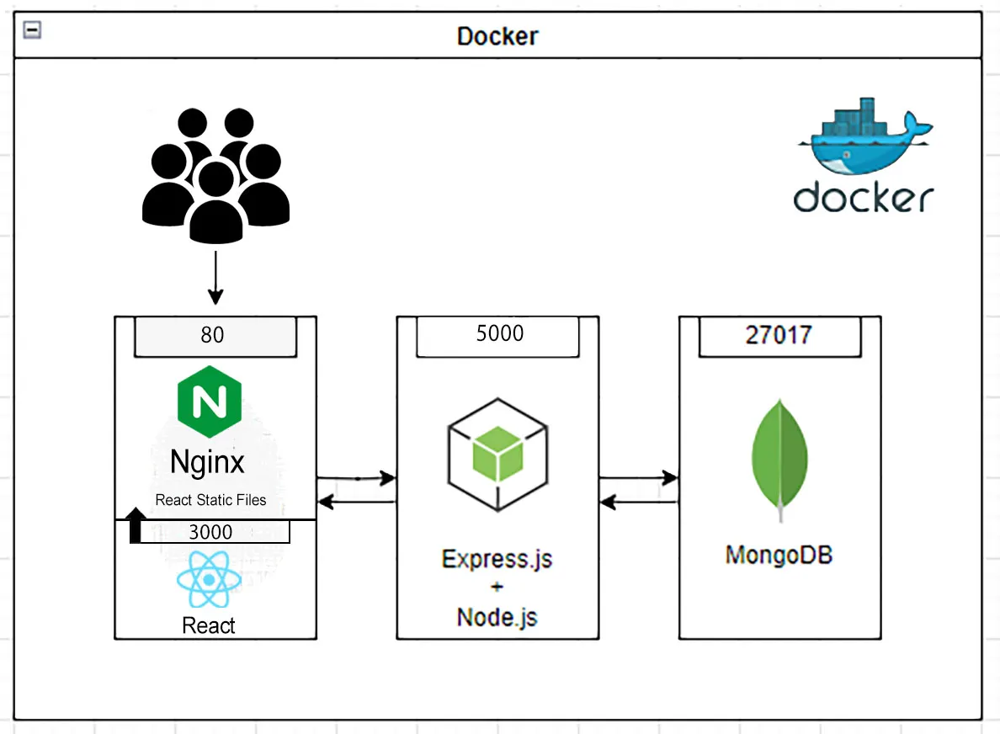

# MERN Stack (MongoDB, Express.js, React, and Node.js) with NGinx and Docker Compose

* https://dzone.com/articles/mastering-full-stack-development-a-comprehensive
* https://medium.com/@bjnandi/containerize-your-full-stack-web-application-mern-with-docker-compose-4900156ba9dd



```bash
nvm use stable
npm init -y
npm install express mongoose dotenv cors body-parser
npx create-react-app client
mkdir server
cat > server/server.js
cat > .env
cat client/src/App.js
cd client
npx create-react-app client
vi README.md 
cat client/src/App.js 
cat > client/src/App.js 
cat > docker-compose.yml
cat > server/Dockerfile
cat > client/Dockerfile
```

