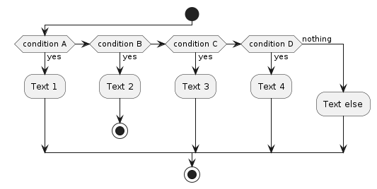

# Exemples des diagrammes UML avec PlantUML

[PLantUML](https://plantuml.com/fr/) est un utilitaire qui permet de créer des diagrammes et des visualisations à l'aide de texte et de code.

Il est très indiqué pour documenter un projet logiciel et maintenir sa documentation via un dépôt Git.

La transformation vers du PNG ou du SVG peut se faire avec [une ligne de commande avec docker](#génération).

## Syntaxe

`car.plantuml`:


`auth.plantuml`:


## Editor

[Visual Studio extension](https://marketplace.visualstudio.com/items?itemName=jebbs.plantuml)

Live editor
* https://www.panjianning.com/puml
* https://github.com/panjianning/plantuml-live-editor

Choose SVG for export

## Generation with Docker 

```bash
docker run -t --rm  -v `pwd`:/var/docs plantuml/plantuml -h
FILES=$(for f in *.plantuml; do echo /var/docs/$f; done)
docker run -t --rm  -v `pwd`:/var/docs plantuml/plantuml -nbthread 8 -tsvg -o /var/docs $FILES
docker run -t --rm  -v `pwd`:/var/docs plantuml/plantuml -nbthread 8 -tpng -o /var/docs $FILES
```

## CI

[PlantUML and GitLab](https://docs.gitlab.com/ee/administration/integration/plantuml.html)

## Génération

### Génération d'un diagramme de classe en SVG

```bash
FILES=$(for f in *.plantuml; do echo /var/docs/$f; done)
docker run -t --rm  -v `pwd`:/var/docs plantuml/plantuml -nbthread 8 -tsvg -o /var/docs $FILES
```


## Génération d'un diagramme de classe en PNG
```bash
FILES=$(for f in *.plantuml; do echo /var/docs/$f; done)
docker run -t --rm  -v `pwd`:/var/docs plantuml/plantuml -nbthread 8 -tpng -o /var/docs $FILES
```

## Bonus
* [plantuml2mysql](https://github.com/grafov/plantuml2mysql)
* [sql2puml](https://github.com/bmrussell/sql2puml)

## Exemples

### Diagrammes de cas d'usage


### Diagrammes d'objets


### Diagrammes d'activités




### Diagrammes d'état


### Diagrammes de composants


### Diagrammes de déploiement


### Schéma SQL


### XEarth


