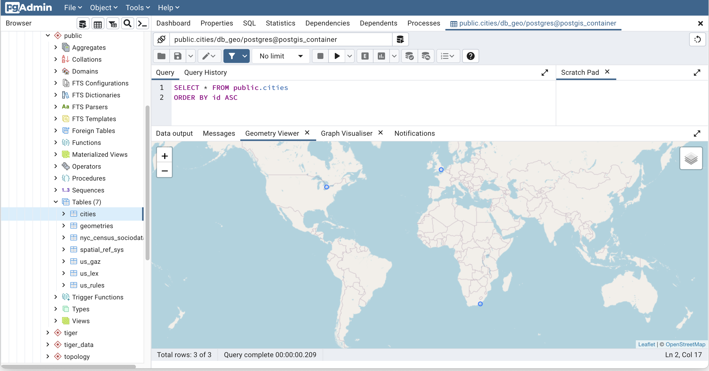
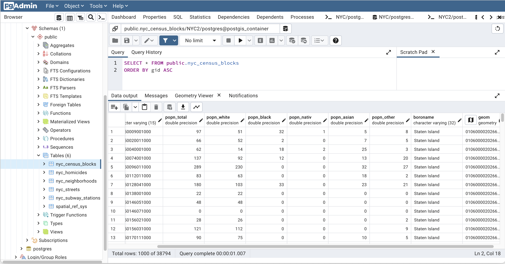
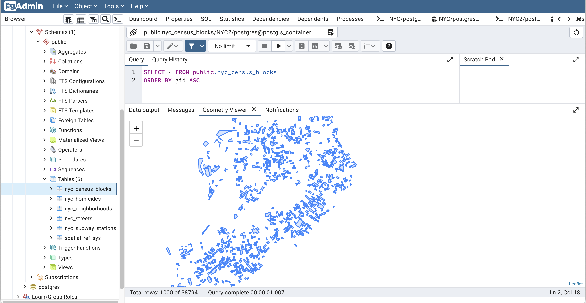

# PostGIS

PostGIS is one of the most awesome extensions for PostgreSQL and can turn a relational database into a really powerful GIS ([Geographic Information System](https://en.wikipedia.org/wiki/Geographic_information_system)).

PostGIS is a Postgres extension for spatial data types like points, lines, and polygons to be stored inside a database. Most commonly you’ll see people using PostGIS with spatial points on a map or globe in longitude and latitude, but there’s some other interesting use cases out there like neuroscience and networking so it can be used for any system with spatial relationships. PostGIS also has a large set of functions that allow you to work with geography and geometry inside sql and indexes to make database tasks efficient.

## Start the DBMS

```bash
mkdir -p data/postgis
docker-compose up -d
```

```bash
docker-compose ps
docker-compose logs -f
```


Interact with the DBMS using the [`psql` command](https://docs.postgresql.fr/10/app-psql.html).
The password is still `changeme`.
```bash
docker exec -it postgis_container psql -U postgres -W
```

> Nota Bene: You can stop the container with `docker-compose stop` and destroy the container with `docker-compose down`. However,Postgres DBMS files are still stored in the host directory `./data/postgis`.


## Execute the PSQL statements

```sql
SELECT postgis_full_version();

-- Drop the existing database if exists
DROP DATABASE IF EXISTS db_geo;

-- Create a new database
CREATE DATABASE db_geo;

\l

-- Enable PostGIS (includes raster)
CREATE EXTENSION postgis;
-- Enable Topology
CREATE EXTENSION postgis_topology;
-- Enable PostGIS Advanced 3D 
-- and other geoprocessing algorithms
CREATE EXTENSION postgis_sfcgal;
-- fuzzy matching needed for Tiger
CREATE EXTENSION fuzzystrmatch;
-- rule based standardizer
CREATE EXTENSION address_standardizer;
-- example rule data set
CREATE EXTENSION address_standardizer_data_us;
-- Enable US Tiger Geocoder
CREATE EXTENSION postgis_tiger_geocoder;
-- routing functionality
CREATE EXTENSION pgrouting;
-- spatial foreign data wrappers
CREATE EXTENSION ogr_fdw;

-- LIDAR support
CREATE EXTENSION pointcloud;
-- LIDAR Point cloud patches to geometry type cases
CREATE EXTENSION pointcloud_postgis;
```

## Simple database and queries

```sql
CREATE TABLE geometries (name varchar, geom geometry);

INSERT INTO geometries VALUES
  ('Point', 'POINT(0 0)'),
  ('Linestring', 'LINESTRING(0 0, 1 1, 2 1, 2 2)'),
  ('Polygon', 'POLYGON((0 0, 1 0, 1 1, 0 1, 0 0))'),
  ('PolygonWithHole', 'POLYGON((0 0, 10 0, 10 10, 0 10, 0 0),(1 1, 1 2, 2 2, 2 1, 1 1))'),
  ('Collection', 'GEOMETRYCOLLECTION(POINT(2 0),POLYGON((0 0, 1 0, 1 1, 0 1, 0 0)))');

SELECT name, ST_AsText(geom) FROM geometries;

SELECT name, ST_AsGeoJSON(geom) FROM geometries;

SELECT name, ST_AsSVG(geom) FROM geometries;

SELECT name, ST_AsGML(geom) FROM geometries;

SELECT name, ST_Length(geom) FROM geometries;

SELECT SUM(ST_Length(geom)) AS TotalLength FROM geometries;


SELECT
  G1.name AS g1_name,
  G2.name AS g2_name
FROM geometries AS G1
JOIN geometries AS G2
ON ST_Contains(G1.geom, G2.geom);

SELECT
  G1.name AS g1_name,
  G2.name AS g2_name
FROM geometries AS G1
JOIN geometries AS G2
ON ST_Intersects(G1.geom, G2.geom);

```


```sql
CREATE TABLE cities ( id int4 primary key, name varchar(50), geom geometry(POINT,4326) );
INSERT INTO cities (id, geom, name) VALUES (1,ST_GeomFromText('POINT(-0.1257 51.508)',4326),'London, England');
INSERT INTO cities (id, geom, name) VALUES (2,ST_GeomFromText('POINT(-81.233 42.983)',4326),'London, Ontario');
INSERT INTO cities (id, geom, name) VALUES (3,ST_GeomFromText('POINT(27.91162491 -33.01529)',4326),'East London,SA');

SELECT * FROM cities;
SELECT id, ST_AsText(geom), ST_AsEwkt(geom), ST_X(geom), ST_Y(geom) FROM cities;

-- Jointures spatiales
SELECT p1.name,p2.name,ST_DistanceSphere(p1.geom,p2.geom)
FROM cities AS p1, cities AS p2 WHERE p1.id > p2.id;

SELECT p1.name,p2.name,ST_DistanceSpheroid(p1.geom,p2.geom, 'SPHEROID["GRS_1980",6378137,298.257222]')
FROM cities AS p1, cities AS p2 WHERE p1.id > p2.id;
```


## PGAdmin

You will very likely want a GUI interface for working with Postgres and PostGIS. pgAdmin has a nice 👁️ geometry viewer for seeing PostGIS data on map format. The primary use of pgAdmin is working with the data, so you’ll still need a desktop GIS to do lots of layering, labeling, and fancy map work


Browse the [PGAdmin console](http://localhost:5050).

Set a new password for PGAdmin.

Add a new server.
* In `General` tab, The `name` is `postgis_container`.
* In `Connection` tab, the `hostname` is `postgis_container`, the `username` is `postgres` and the  `password` is `changeme`.

Browse the DB tree on the left panel.

The default query for table `cities` is:
```sql
SELECT * FROM public.cities
ORDER BY id ASC 
```

Use the geometry viewer tab for showing the cities on a map.




## QGIS

TODO

You will very likely want a desktop app for working with GIS data, very similar to the GUI interfaces for databases like pgAdmin but with a lot more functions for loading maps, labeling and enhancing them.


## PostGIS Workshop 

The PostGIS Workshop relies on the NY city dataset.

### Get the dataset

```bash
curl http://s3.cleverelephant.ca/postgis-workshop-2020.zip -o work/postgis-workshop-2020.zip 
(cd work; unzip postgis-workshop-2020.zip)
```

### Load the dataset into PostGIS database with PGAdmin

Open the PGAdmin console

Create a new database `NYC`.

Create the PostGIS extension using the PSQL console.
```sql
CREATE EXTENSION postgis;
```

Restore the backup of the database located into `/work/postgis-workshop/data/nyc_data.backup

View the data (for instance on table `nyc_census_blocks`)

Select the geom viewer into the header of the `geom` column.




## More
* http://postgis.net/workshops/postgis-intro/loading_data.html
* http://postgis.net/workshops/postgis-intro/geometries_exercises.html
* https://www.crunchydata.com/blog/postgis-for-newbies

## TODO
* [ ] add [GeoServer](https://hub.docker.com/r/kartoza/geoserver) as web frontend
* [ ] add [MapServer](https://hub.docker.com/r/mapserver/mapserver) as web frontend
