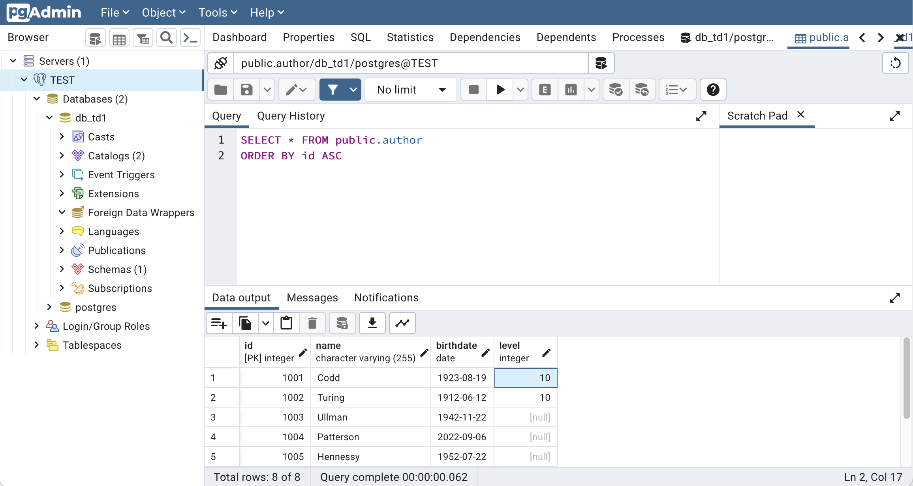

# Postgres tutorial

## Start the DBMS

```bash
mkdir -p data/postgres
docker-compose up -d
```

```bash
docker-compose ps
docker-compose logs -f
```

Interact with the DBMS using the [`psql` command](https://docs.postgresql.fr/10/app-psql.html).
The password is still `changeme`.
```bash
docker exec -it postgres_container psql -U postgres -W
```

## Execute the PSQL statements

```sql
\l

-- Drop the existing database if exists
DROP DATABASE IF EXISTS db_turing;

-- Create a new database
CREATE DATABASE db_turing;

-- Connect to the database
\connect db_turing

SET statement_timeout = 0;
SET lock_timeout = 0;
SET idle_in_transaction_session_timeout = 0;
SET client_encoding = 'UTF8';
SET standard_conforming_strings = on;
SET check_function_bodies = false;
SET client_min_messages = warning;
SET row_security = off;

DROP TABLE IF EXISTS PERSON CASCADE;
DROP TABLE IF EXISTS TURING_AWARD;

-- Create the table PERSON
CREATE TABLE PERSON (
   ID           SERIAL PRIMARY KEY  NOT NULL,
   NAME         VARCHAR (255) NOT NULL,
   BIRTHDATE    DATE NOT NULL DEFAULT CURRENT_DATE,
   LEVEL        INT
);

-- Show tables
\d
-- Show schema of table PERSON
\d PERSON

-- Insert new rows into table PERSON
INSERT INTO PERSON (ID, NAME, BIRTHDATE, LEVEL) VALUES
    (1001, 'Codd', '1923-08-19', 10),
    (1002, 'Turing', '1912-06-12', 10),
    (1003, 'Ullman', '1942-11-22', NULL),
    (1004, 'Patterson', DEFAULT, NULL),
    (1005, 'Hennessy', '1952-07-22', NULL),
    (1006, 'Stonebraker', '1943-10-11', NULL);

-- Show persons
SELECT * FROM PERSON;

-- Show persons with 'undefined' level
SELECT * FROM PERSON WHERE LEVEL IS NOT NULL;

-- Update level of persons with 'undefined' level
UPDATE PERSON SET LEVEL=0 WHERE LEVEL IS NOT NULL;

-- Insert a new row into table PERSON
INSERT INTO PERSON (NAME, BIRTHDATE) VALUES
    ('Gray', DEFAULT);

-- Show tables
\d
-- Show schema of table PERSON
\d PERSON
-- Show schema of PERSON_ID_SEQ table used for sequencing the ID column of table PERSON
\d PERSON_ID_SEQ

-- Show persons
SELECT * FROM PERSON;

-- Show the three first persons
SELECT * FROM PERSON LIMIT 3;

-- Show persons sorted by birthdate
SELECT * FROM PERSON ORDER BY BIRTHDATE ASC;

-- Show persons sorted by age
SELECT NAME, AGE(BIRTHDATE) AS AGE FROM PERSON ORDER BY AGE ASC;

-- Show persons sorted by age (descending)
SELECT NAME, AGE(BIRTHDATE) AS AGE FROM PERSON ORDER BY AGE DESC;

-- Import a CSV file into a table using COPY statement.
-- Remark: the CSV file is into a directory mounted by the container
COPY PERSON(ID, NAME, BIRTHDATE, LEVEL)
FROM '/work/turing/persons.csv'
DELIMITER ','
CSV HEADER;

-- Show persons
SELECT * FROM PERSON;

-- Create the table TURING_AWARD
CREATE TABLE TURING_AWARD (
   YEAR         INT NOT NULL,
   ID           INT,
   CONSTRAINT FK_PERSON
      FOREIGN KEY(ID) 
	  REFERENCES PERSON(ID)
);

-- Insert new rows into table TURING_AWARD (See https://en.wikipedia.org/wiki/Turing_Award)
INSERT INTO TURING_AWARD (ID, YEAR) VALUES
    (1001, 1981),
    (1003, 2020),
    (1004, 2017),
    (1005, 2017),
    (1006, 2014),
    (1007, 2013),
    (1008, 1974);

-- Show turing awards ordered by year
SELECT * FROM TURING_AWARD ORDER BY YEAR ASC;

-- Show name of persons with turing award
SELECT * FROM PERSON A, TURING_AWARD T WHERE A.ID=T.ID;
SELECT * FROM PERSON A NATURAL JOIN TURING_AWARD T;
SELECT * FROM PERSON A INNER JOIN TURING_AWARD T ON A.ID=T.ID;
SELECT * FROM PERSON A LEFT JOIN TURING_AWARD T ON A.ID=T.ID;
SELECT * FROM PERSON A RIGHT JOIN TURING_AWARD T ON A.ID=T.ID;
SELECT * FROM PERSON A FULL JOIN TURING_AWARD T ON A.ID=T.ID;

-- Show name of persons with turing award ordered by year
SELECT A.NAME, T.YEAR FROM PERSON A, TURING_AWARD T WHERE A.ID=T.ID ORDER BY YEAR ASC;

-- Show name of persons that are not awarded
SELECT NAME FROM PERSON WHERE ID NOT IN (SELECT ID FROM TURING_AWARD);

-- Insert a new row into table TURING_AWARD (the foreign constraint is violated since person id does not exist)
INSERT INTO TURING_AWARD (ID, YEAR) VALUES
    (9999, 2099);

-- Exercice: Increment by one the level of each person

-- Exercice: List the numbers of awarded persons per year

-- Exercice: Alter table in order to rename NAME into LASTNAME and to add FIRSTNAME and MIDDLENAME columns

-- Exercice: List the persons awarded the same year

```

## PGAdmin

Browse the [PGAdmin console](http://localhost:5050).

Set a new password for PGAdmin.

Add a new server.
* In `General` tab, The `name` is `TEST`.
* In `Connection` tab, the `hostname` is `postgres_container`, the `username` is `postgres` and the  `password` is `changeme`.

Browse the DB tree on the left panel.



## Enjoy


## Dump the database

```bash
docker exec -it postgres_container pg_dumpall -c -U postgres > dump.sql
cat dump.sql
```

## At the end

Stop and remmove the composition
```bash
docker-compose down
```

Remove the DBMS files
```bash
rm -fr data/
```

## Extra PSQL statements

### Date and Time

```sql
-- Show current date
SELECT CURRENT_DATE;

-- Show current time
SELECT CURRENT_TIME;

-- Show current time
SELECT CURRENT_TIME(2);

-- Show current time
SELECT LOCALTIME;

-- Convert date
SELECT TO_TIMESTAMP(
    '2022-09-01 12:00:00',
    'YYYY-MM-DD HH:MI:SS'
);

-- Show current timestamp
SELECT NOW();
```

## Nota Bene
* Postgres files are stored in the host dir `./data/postgres`

## References
* https://www.postgresqltutorial.com/postgresql-tutorial
